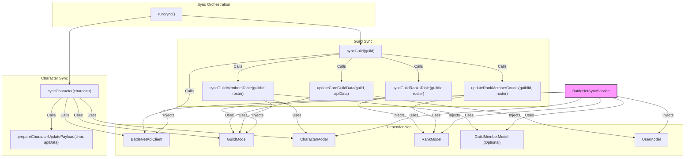

# Plan: Refactor BattleNet Sync Service for Maintainability & Testability

## 1. Current State Analysis

The `backend/src/jobs/battlenet-sync.service.ts` file is responsible for synchronizing guild and character data between the application's database and the Battle.net API.

**Key Responsibilities:**

*   Managing Battle.net API client credentials token.
*   Fetching guild data and roster from Battle.net.
*   Updating guild information in the database (`guilds` table).
*   Synchronizing the `guild_members` table based on the roster.
*   Synchronizing the `guild_ranks` table.
*   Fetching detailed character data (profile, equipment, mythic+, professions) from Battle.net.
*   Updating character information in the database (`characters` table).
*   Orchestrating the overall sync process for outdated guilds and characters.

**Observations:**

*   The service handles multiple concerns: API authentication, API data fetching, data transformation, and database persistence logic.
*   Several methods are quite large and complex (e.g., `syncGuildMembersTable`, `syncCharacter`).
*   Direct database interactions (queries and model calls) are mixed with API interaction logic.
*   Error handling is present but could be more granular.
*   Some potential inefficiencies exist (e.g., fetching all characters in `syncGuildMembersTable`).
*   Testing is difficult due to direct dependencies on external APIs (`battleNetService`) and the database (`guildModel`, `characterModel`, `rankModel`, `userModel`, direct `client.query`).

## 2. Maintainability Issues

*   **Large Method Size:** Methods like `syncGuildMembersTable` (over 100 lines) and `syncCharacter` are long and perform many distinct steps, making them hard to read, understand, and modify.
*   **Tight Coupling:** The service is tightly coupled to specific implementations of `battleNetService` and various database models. Changes in these dependencies can directly impact the sync service.
*   **Mixed Concerns:** Business logic (comparing roster data, determining updates), API interaction, and database persistence are interwoven within the same methods. This violates the Single Responsibility Principle.
*   **Complex Logic:** The logic for comparing existing members with the roster, handling new characters, updating ranks, and linking data involves multiple steps and conditional checks within `syncGuildMembersTable`, increasing complexity.
*   **Inefficient Data Fetching:** Fetching all characters (`characterModel.findAll()`) in `syncGuildMembersTable` is inefficient, especially as the character table grows.

## 3. Testability Issues

*   **External API Dependency:** Direct calls to `battleNetService` make unit testing difficult without mocking the entire service or hitting the actual API (which is undesirable for unit tests).
*   **Database Dependency:** Direct database operations (model calls, raw queries) make it hard to test the logic in isolation without a real database connection or complex mocking of the database layer.
*   **Lack of Dependency Injection:** Dependencies are directly imported, making it hard to swap them out with mocks or stubs during testing.
*   **Side Effects:** Methods directly modify the database state, making tests harder to set up, run repeatably, and tear down.

## 4. Proposed Refactoring Plan

The goal is to decouple concerns, improve readability, and make the service testable.

**Phase 1: Decoupling & Structuring**

1.  **Extract API Interaction:**
    *   Create a dedicated `BattleNetApiClient` class or module.
    *   Move `ensureClientToken`, `getGuildData`, `getGuildRoster`, `getEnhancedCharacterData` calls (and potentially the token logic itself) into this new client/adapter.
    *   The `BattleNetSyncService` will *depend* on this client (via constructor injection).
    *   *Benefit:* Isolates API specifics, allows mocking the API client for tests.

2.  **Extract Database Operations:**
    *   Refine existing models (`guildModel`, `characterModel`, `rankModel`, `userModel`) to encapsulate all necessary database queries related to the sync process. Avoid raw `client.query` calls within the service.
    *   For example, `characterModel` should have methods like `findOrCreateCharactersByNameRealm(list)` or `getCharacterIdsByKeys(keys)`. `guildMemberModel` (if created) could handle the complex add/update/delete logic.
    *   The `BattleNetSyncService` will *depend* on these models/repositories (via constructor injection).
    *   *Benefit:* Isolates database logic, allows mocking the data layer for tests.

3.  **Dependency Injection:**
    *   Modify the `BattleNetSyncService` constructor to accept instances of the `BattleNetApiClient` and the required database models/repositories.
    *   Update the instantiation point (likely where the singleton `battleNetSyncService` is created) to provide these dependencies.
    *   *Benefit:* Enables easy mocking for testing.

**Phase 2: Method Decomposition & Logic Refinement**

4.  **Break Down `syncGuild`:**
    *   Extract the logic for updating the core guild data (step 3 in the original code) into a separate private method.
    *   Keep `syncGuild` as the orchestrator calling the API client, the new private method, `syncGuildMembersTable`, and `syncGuildRanksTable`.

5.  **Refactor `syncGuildMembersTable`:**
    *   **Improve Character Fetching:** Instead of `characterModel.findAll()`, fetch only the characters relevant to the current roster members using a more targeted query (e.g., `characterModel.findByKeys(rosterMemberKeys)`).
    *   **Extract Comparison Logic:** Create a pure function that takes the existing members map and the roster members map and returns lists of members to add, update, and remove, plus characters to create.
    *   **Extract Persistence Logic:** Move the actual database `INSERT`, `UPDATE`, `DELETE` operations for `guild_members` (and potentially `characters`) into dedicated model methods (e.g., `characterModel.bulkCreate`, `guildMemberModel.bulkSync`).
    *   The refactored `syncGuildMembersTable` will fetch data, call the comparison function, and then call the persistence methods.
    *   *Benefit:* Smaller, focused methods; testable comparison logic; cleaner persistence.

6.  **Refactor `syncCharacter`:**
    *   Extract the logic for preparing the `updatePayload` into a separate function or method.
    *   The main method becomes simpler: fetch data via API client, prepare payload, update via character model.

7.  **Refine Rank Syncing:**
    *   Ensure `syncGuildRanksTable` and `updateRankMemberCounts` rely solely on the injected `rankModel` for persistence.
    *   Consider combining these into a single `syncRanks` method if appropriate.

8.  **Improve Error Handling:**
    *   Ensure specific errors are thrown or logged when API calls or DB operations fail within the extracted components.
    *   The main service methods should catch errors from dependencies and log context-specific information (e.g., "Failed to sync members for guild X").

**Phase 3: Testing Implementation (Covered in next section)**

**(Optional) Proposed Structure Diagram (Mermaid):**

## 5. Proposed Testing Strategy

1.  **Unit Tests:**
    *   **`BattleNetSyncService`:** Test the orchestration logic. Mock all injected dependencies (API Client, Models). Verify that the correct methods on dependencies are called with the expected arguments based on input. Test `runSync`, `syncGuild`, `syncCharacter`.
    *   **`BattleNetApiClient` (if created):** Test token handling logic. Mock the underlying HTTP fetch/request library. Verify correct API endpoints are called.
    *   **Database Models:** Test individual model methods (`find`, `create`, `update`, `bulkSync`, etc.). These might be closer to integration tests if they hit a test database, or unit tests if the DB driver/client itself is mocked.
    *   **Helper/Pure Functions:** Test data transformation and comparison logic (e.g., the extracted member comparison logic) with various input scenarios.

2.  **Integration Tests:**
    *   **Guild Sync Flow:** Test the `syncGuild` process. Mock the `BattleNetApiClient` to return predefined guild/roster data. Use a *test database* (e.g., a separate Docker container running Postgres, seeded with test data) to verify that the database state (guilds, members, ranks) is correctly updated after the sync runs.
    *   **Character Sync Flow:** Test the `syncCharacter` process similarly. Mock the API client, use a test database, and verify character data updates.
    *   **`runSync` Flow:** Test the overall `runSync` orchestration. Mock the API client. Use a test database seeded with guilds/characters in various states (up-to-date, outdated) and verify that only the outdated ones trigger sync operations and the database is updated correctly.

3.  **End-to-End Tests (Use Sparingly):**
    *   Could involve running the sync against a dedicated test Battle.net application and a test database.
    *   These are brittle, slow, and depend heavily on the external API being stable. Reserve for critical path validation if absolutely necessary. Mocking the API at the HTTP level is often a better approach.

**Testing Tools:**

*   Test Runner: Jest or Vitest
*   Mocking: Jest's built-in mocking, or libraries like `ts-mockito`.
*   Test Database Management: Docker Compose to spin up/down a test Postgres instance, Knex migrations/seeds for setup.

## 6. Closing the Loop

By implementing comprehensive unit and integration tests based on the refactored, decoupled structure:

*   **Confidence in Changes:** Any future modifications to the sync logic, API handling, or database interactions can be validated by running the test suite. Failures indicate regressions.
*   **Refactoring Safety Net:** The tests provide confidence when further refactoring or optimizing parts of the service.
*   **Bug Prevention:** Tests cover edge cases and different data scenarios, reducing the likelihood of bugs reaching production.
*   **Documentation:** Well-written tests serve as executable documentation for how the service is expected to behave.

This structured approach with strong test coverage significantly improves maintainability and allows developers to "close the loop" by verifying changes automatically.