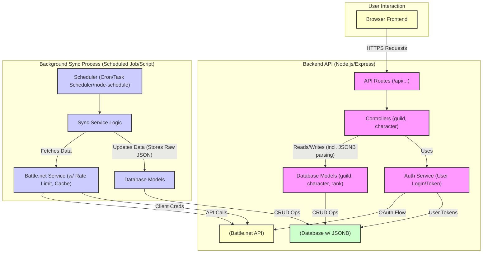

# Refactoring Plan: Separate Battle.net API Calls

**Goal:** Refactor the backend so that API endpoints requested by the frontend *only* interact with the local database. A separate background process will periodically fetch data from the Battle.net API, store the raw JSON responses in the database, and update key indexed fields.

**Revised Architecture:**

1. **Frontend API Endpoints:** Query the local database via models. Logic within controllers/models will parse required data from stored `JSONB` fields before sending responses.
2. **Database:** Will have tables (`guilds`, `characters`, `guild_members`, etc.) with essential indexed columns (IDs, names, realm, region, FKs, `last_synced_at`) and dedicated `JSONB` columns (e.g., `guild_data_json`, `profile_json`, `roster_json`) to hold the raw API responses.
3. **Background Sync Service:** Fetches data via `battleNetService`, stores the raw JSON into the appropriate `JSONB` columns, and updates the essential indexed fields and `last_synced_at` timestamps.
4. **Authentication:** User OAuth remains in the main API. Sync service will use **Client Credentials** grant type (preferred).

**Revised Detailed Plan Steps:**

1. **Phase 1: Database Schema Modification (JSONB Approach)**
    * **Action:** Review Database Schema (`models/*.model.ts`, `shared/types/`).
    * **Details:**
        * `guilds` table: Ensure `id` (PK), `bnet_guild_id` (indexed), `name` (indexed), `realm` (indexed), `region` (indexed), `leader_id` (FK to users), `last_synced_at` exist. Add `guild_data_json` (JSONB) and `roster_json` (JSONB).
        * `characters` table: Ensure `id` (PK), `bnet_character_id` (indexed), `name` (indexed), `realm` (indexed), `region` (indexed), `user_id` (FK to users), `guild_id` (FK to guilds), `last_synced_at` exist. Add `profile_json` (JSONB), `equipment_json` (JSONB), `mythic_profile_json` (JSONB), `professions_json` (JSONB).
        * `guild_members` table: Ensure `id` (PK), `guild_id` (FK), `character_id` (FK), `rank` exist. Keep indexed fields `character_name` and `character_class`. Add `member_data_json` (JSONB) to store the individual member object from the roster response.
        * `ranks` table: No changes likely needed (`id`, `guild_id`, `rank_id`, `rank_name`).
    * **Action:** Create and Apply Database Migrations (`migrations/`).
    * **Details:** Write Knex migration files to add/modify tables and columns (using `.jsonb()`). Run migrations.

2. **Phase 2: Refactor API Endpoints (Controllers/Models)**
    * **Action:** Modify `guild.controller.ts` (and potentially `character.controller.ts`).
    * **Details:**
        * Remove *all* calls to `battleNetService` functions within frontend-facing controller methods.
        * Rewrite logic to fetch records with `JSONB` fields from models.
        * Implement logic (in controllers or model helpers) to parse necessary data *from* the `JSONB` fields for API responses.

3. **Phase 3: Create Background Sync Service**
    * **Action:** Create `backend/src/jobs/battlenet-sync.service.ts`.
    * **Details:**
        * Implement core sync logic: Fetch items needing updates, get token (Phase 4), call `battleNetService`, store raw JSON in `JSONB` columns, update indexed fields & `last_synced_at`.
        * Implement caching checks and respect rate limits.
        * Add error logging and retries.

4. **Phase 4: Authentication for Sync Service**
    * **Action:** Implement **Client Credentials** token strategy.
    * **Details:** Configure `battlenet.service` or the sync service to use client ID/secret to obtain a token for the sync process.

5. **Phase 5: Implement Sync Trigger**
    * **Action:** Choose and set up a scheduling mechanism.
    * **Details:**
        * **Simple:** Create `backend/scripts/run-sync.ts` and schedule via OS tools (cron, Task Scheduler).
        * **Integrated:** Use `node-schedule` within `index.ts`.

6. **Phase 6: Refactor Supporting Services (Optional but Recommended)**
    * **Action:** Review `guild-leadership.service.ts`, `guild-roster.service.ts`.
    * **Details:** Adapt services to work with data parsed from `JSONB` fields.

7. **Phase 7: Testing & Deployment**
    * **Action:** Implement comprehensive testing (Unit, Integration, E2E).
    * **Action:** Deploy changes, configure sync trigger, and monitor logs.

**High-Level Architecture Diagram:**

