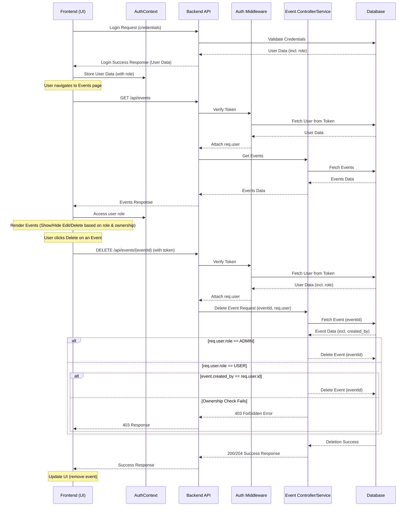

# Implementation Plan: Admin CRUD Privileges

**Objective:** Grant users with the 'ADMIN' role full Create, Read, Update, and Delete (CRUD) permissions on resources, bypassing standard ownership checks. Regular users ('USER' role) will retain ownership-based restrictions. This plan initially focuses on the 'Events' resource.

**Version:** 1.0
**Date:** 2025-04-21

---

## 1. Backend Modifications

### 1.1. Identify User Role in Requests
   - **Assumption:** Authentication middleware (e.g., Passport.js, custom middleware) already verifies the user's token and attaches the user object (including their `id` and `role`) to the `request` object (e.g., `req.user`).
   - **Verification:** Confirm that the authentication middleware populates `req.user` with the structure `{ id: number, role: UserRole, ... }`. If not, update the middleware to include the `role`.

### 1.2. Update Event Service/Controller Logic
   - **Location:** Identify the service or controller functions responsible for handling `UPDATE` (PUT/PATCH) and `DELETE` requests for events (likely within `backend/src/controllers/event.controller.ts` or a corresponding `event.service.ts`).
   - **Modification:** Locate the points where ownership is currently checked, likely using `eventModel.isEventCreator(eventId, req.user.id)`.
   - **Conditional Bypass:** Modify the logic to bypass the ownership check if `req.user.role === UserRole.ADMIN`.

   **Example (Pseudocode in Controller):**

   ```typescript
   // Inside PUT /api/events/:eventId or DELETE /api/events/:eventId handler

   const eventId = req.params.eventId;
   const userId = req.user.id;
   const userRole = req.user.role;

   // Fetch the event (required for both checks or the update/delete itself)
   const event = await eventModel.findById(eventId);
   if (!event) {
     throw new AppError('Event not found', 404);
   }

   let canModify = false;
   if (userRole === UserRole.ADMIN) {
     // Admin bypasses ownership check
     canModify = true;
   } else {
     // Regular user requires ownership check
     canModify = event.created_by === userId; // Direct check or use isEventCreator
     // Alternatively: canModify = await eventModel.isEventCreator(eventId, userId);
   }

   if (!canModify) {
     throw new AppError('Forbidden: You do not have permission to modify this event', 403);
   }

   // Proceed with update or delete logic...
   // await eventModel.update(eventId, req.body); or await eventModel.deleteEvent(eventId);

   res.status(200).json({ message: 'Event updated/deleted successfully' });
   ```

### 1.3. API Endpoint Review
   - **Review:** Ensure no other middleware or logic layers are enforcing ownership checks that also need modification.
   - **Routes:** Check `backend/src/routes/event.routes.ts` for any route-specific middleware that might interfere.

---

## 2. Frontend Modifications

### 2.1. Store User Role in AuthContext
   - **Location:** `frontend/src/context/AuthContext.tsx`.
   - **Fetch Role:** Ensure the user's `role` is fetched during the login process or when validating the session (e.g., from the `/api/auth/me` or login response). The API endpoint providing user data should include the `role`.
   - **Update Context State:** Modify the `AuthContext` state to store the `user` object, including the `role`.
   - **Update Context Type:** Update the TypeScript interface for the user object within the context to include the `role` property (`role: UserRole`).

   **Example (Pseudocode in AuthContext):**

   ```typescript
   interface AuthState {
     isAuthenticated: boolean;
     user: {
       id: number;
       battletag: string;
       role: UserRole; // Add role here
       // other user properties...
     } | null;
     // ... other state properties
   }

   // Inside login or checkAuth function:
   const login = async (credentials) => {
     const response = await authService.login(credentials); // Assume service returns user data including role
     const userData = response.data; // { id, battletag, role, ... }
     dispatch({ type: 'LOGIN_SUCCESS', payload: userData });
   };

   // Reducer case:
   case 'LOGIN_SUCCESS':
     return {
       ...state,
       isAuthenticated: true,
       user: action.payload, // Ensure payload includes the role
     };
   ```

### 2.2. Conditionally Render UI Elements (Edit/Delete Buttons)
   - **Location:** Components responsible for displaying lists of events or event details (e.g., `EventList.tsx`, `EventCard.tsx`, `EventDetails.tsx`).
   - **Access Role:** Use the `useAuth` hook (or equivalent) to access the `user` object and their `role` from `AuthContext`.
   - **Conditional Logic:** Implement conditional rendering for Edit and Delete buttons/icons:
     - If `user.role === UserRole.ADMIN`, always show the buttons.
     - If `user.role === UserRole.USER`, show the buttons *only if* `event.created_by === user.id`.

   **Example (Pseudocode in EventCard component):**

   ```typescript
   import { useAuth } from '../context/AuthContext';
   import { Event, UserRole } from '../../../shared/types'; // Import shared types

   interface EventCardProps {
     event: Event;
   }

   const EventCard: React.FC<EventCardProps> = ({ event }) => {
     const { user } = useAuth();

     const canEditOrDelete = user && (
       user.role === UserRole.ADMIN || // Admin can always edit/delete
       (user.role === UserRole.USER && event.created_by === user.id) // User can edit/delete if owner
     );

     return (
       <div>
         {/* Event details */}
         <h3>{event.title}</h3>
         <p>{event.description}</p>
         {/* ... other details */}

         {canEditOrDelete && (
           <div>
             <button onClick={() => handleEdit(event.id)}>Edit</button>
             <button onClick={() => handleDelete(event.id)}>Delete</button>
           </div>
         )}
       </div>
     );
   };
   ```

### 2.3. Frontend API Service Review
   - **Review:** Ensure API service calls (`frontend/src/services/api/event.service.ts` or similar) correctly handle potential 403 Forbidden errors if a non-admin user attempts an unauthorized action (though UI should prevent this).

---

## 3. Data Flow

1.  **Login/Auth:** User logs in -> Frontend calls `/api/auth/login` -> Backend validates -> Backend returns user data including `id` and `role`.
2.  **Context Update:** Frontend stores user data (with role) in `AuthContext`.
3.  **UI Rendering:** Frontend components access `user` from `AuthContext`. Event lists/details render Edit/Delete buttons based on the logic in section 2.2.
4.  **API Request (Update/Delete):** User clicks Edit/Delete -> Frontend calls `PUT /api/events/:id` or `DELETE /api/events/:id`. The request includes the user's auth token in headers.
5.  **Backend Auth:** Authentication middleware verifies the token, retrieves the user (`id`, `role`), and attaches it to `req.user`.
6.  **Backend Authorization:** The `event.controller` (or service) receives the request. It checks `req.user.role`:
    *   If `ADMIN`, it proceeds directly to the database update/delete operation.
    *   If `USER`, it performs an ownership check (`event.created_by === req.user.id`). If the check fails, it returns a 403 Forbidden error. If it passes, it proceeds.
7.  **Database Operation:** The action (update/delete) is performed on the `events` table.
8.  **Backend Response:** Backend sends a success (200/204) or error (403/404/500) response to the frontend.
9.  **Frontend Update:** Frontend updates the UI based on the response (e.g., removes the deleted event, shows a success/error message).

**Diagram (Mermaid Sequence):**



---

## 4. Affected Resources

-   **Initially:**
    -   `Events` (CRUD operations)
-   **Database Tables:**
    -   `users` (must contain `role` column)
    -   `events` (must contain `created_by` column referencing `users.id`)
-   **Backend Files (Potential):**
    -   `backend/src/controllers/event.controller.ts`
    -   `backend/src/services/event.service.ts` (if exists)
    -   `backend/src/models/event.model.ts` (contains `isEventCreator`)
    -   Authentication middleware file(s)
    -   `backend/src/routes/event.routes.ts`
-   **Frontend Files (Potential):**
    -   `frontend/src/context/AuthContext.tsx`
    -   Components displaying/managing events (e.g., `EventList`, `EventCard`, `EventForm`, `EventDetails`)
    -   `frontend/src/services/api/auth.service.ts` (or equivalent for fetching user data)
    -   `frontend/src/services/api/event.service.ts` (or equivalent)

---

## 5. Future Considerations

-   Extend this pattern to other resources (e.g., Guilds, Characters) as needed.
-   Consider adding a dedicated authorization middleware/service for more complex permission logic if the application scales.
-   Implement UI indicators for admins to clearly distinguish between their own resources and others they can manage due to their role.

---