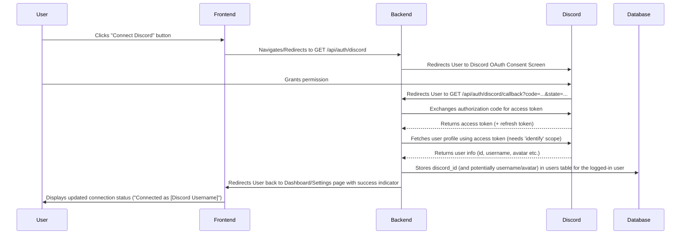

# Plan: Discord Account Synchronization Feature

## 1. Overview

This plan outlines the steps required to allow users of the WoW Guild Manager application to link their Discord accounts. The primary goal is to store the user's unique Discord ID in the `users` database table, enabling future Discord-related integrations.

## 2. UI/UX Design

### 2.1. Initiation Point

* **Proposal:** Add a "Connections" or "Account Settings" section to the user's main `Dashboard` page (`frontend/src/pages/Dashboard.tsx`). Alternatively, create a dedicated `SettingsPage.tsx` if more settings are anticipated.
* **Element:** Within this section, include a "Connect Discord" button.

### 2.2. User Flow



### 2.3. Connection Status Display

* **Location:** In the same "Connections" / "Account Settings" section where the button resides.
* **States:**
  * **Not Connected:** Display the "Connect Discord" button.
  * **Connected:** Hide the "Connect" button. Display text like "Connected as: `[Discord Username]#[Discriminator]`" (or just username). Include a "Disconnect Discord" button.
  * **Loading/Pending:** Show a loading indicator while the callback is being processed.

## 3. Backend Requirements

### 3.1. Database Schema (`users` table)

* **Action:** Add a new column to the `users` table using the following SQL query:

    ```sql
    ALTER TABLE users
    ADD COLUMN discord_id VARCHAR(255) NULL UNIQUE;
    ```

* **Explanation:**
  * `discord_id`: The name of the new column.
  * `VARCHAR(255)`: Data type suitable for storing Discord IDs (which are large numbers represented as strings). 255 characters provide ample space.
  * `NULL`: Allows the column to be empty for users who haven't linked their Discord account.
  * `UNIQUE`: Ensures that a single Discord account can only be linked to one application account. Remove this constraint if multiple application accounts should be linkable to the same Discord account.
* **Note:** While this is the direct SQL, using the project's migration tool (Knex) is the recommended way to manage schema changes (`backend/migrations/`).

### 3.2. API Endpoints (`backend/src/routes/auth.routes.ts`, `backend/src/controllers/auth.controller.ts`)

* **`GET /api/auth/discord`**
  * **Controller:** `auth.controller.ts`
  * **Logic:**
        1. Generate a unique `state` parameter for CSRF protection and store it in the user's session.
        2. Construct the Discord OAuth2 authorization URL with necessary parameters:
            * `client_id`: Your Discord application's Client ID.
            * `redirect_uri`: The absolute URL for the callback endpoint (`GET /api/auth/discord/callback`).
            * `response_type`: `code`.
            * `scope`: `identify` (to get user ID, username, avatar, discriminator). Add `guilds.join` if planning to add users to a server later.
            * `state`: The generated state parameter.
        3. Redirect the user to the constructed Discord URL.
* **`GET /api/auth/discord/callback`**
  * **Controller:** `auth.controller.ts`
  * **Logic:**
        1. Verify the `state` parameter received from Discord matches the one stored in the user's session. If not, abort with an error (CSRF attempt).
        2. Extract the `code` parameter from the query string.
        3. Make a POST request to Discord's token endpoint (`https://discord.com/api/oauth2/token`) with:
            * `client_id`
            * `client_secret`
            * `grant_type`: `authorization_code`
            * `code`: The received code.
            * `redirect_uri`
        4. Receive the access token and refresh token from Discord.
        5. Make a GET request to Discord's user info endpoint (`https://discord.com/api/users/@me`) using the access token in the `Authorization: Bearer [token]` header.
        6. Receive the user's Discord information (id, username, avatar, discriminator).
        7. Retrieve the currently logged-in application user (e.g., from the session).
        8. Update the user's record in the `users` database table, setting the `discord_id` (and potentially storing username/avatar if desired). Handle potential errors (e.g., Discord ID already linked to another account if uniqueness is enforced).
        9. Redirect the user back to the frontend application (e.g., the Dashboard/Settings page) possibly with a query parameter indicating success or failure.

### 3.3. Configuration (`backend/.env.example`, `backend/src/config/index.ts`)

* Add environment variables for `DISCORD_CLIENT_ID` and `DISCORD_CLIENT_SECRET`.
* Update configuration loading to include these variables.

## 4. Frontend Requirements

### 4.1. UI Components (`frontend/src/components/`)

* **`DiscordConnectButton.tsx` (New or integrated):**
  * Displays "Connect Discord" or "Disconnect Discord" based on user's connection status.
  * Handles click events to either initiate the flow (navigate to `GET /api/auth/discord`) or trigger a disconnect action (see below).
* **`DiscordStatusIndicator.tsx` (New or integrated):**
  * Displays "Connected as [Username]" or "Not Connected".
  * Potentially displays the user's Discord avatar.

### 4.2. State Management (`frontend/src/context/AuthContext.tsx` or similar)

* Modify the user state/context to include `discord_id` and potentially `discord_username`, `discord_avatar`.
* Update the logic that fetches user data to include this new information.

### 4.3. API Service (`frontend/src/services/api/auth.service.ts`)

* While the main flow is redirect-based, you might need an API call for disconnecting:
  * **`POST /api/auth/discord/disconnect` (Backend):** Endpoint to clear the `discord_id` for the logged-in user in the database.
  * **`disconnectDiscord()` (Frontend Service):** Function to call the disconnect endpoint. The "Disconnect Discord" button would trigger this.

### 4.4. Routing/Pages (`frontend/src/App.tsx`, `frontend/src/pages/`)

* Ensure the Dashboard/Settings page fetches and displays the Discord connection status correctly.
* The existing `AuthCallback.tsx` might be reusable or adaptable if a dedicated frontend callback page is preferred over direct backend redirects, but the backend-redirect flow described above is simpler.

## 5. Security Considerations

* **CSRF Protection:** Use the `state` parameter in the OAuth2 flow diligently. Validate it strictly on callback.
* **Token Storage:** The primary goal is storing the `discord_id`. If Discord access/refresh tokens need to be stored for future API interactions (e.g., adding users to a guild server), they must be encrypted at rest in the database. For simply identifying the user, storing tokens might not be necessary after the initial ID fetch. Decide if long-term token storage is in scope.
* **Callback Validation:** Ensure the callback handler only processes requests from legitimate Discord redirects and for authenticated application users.
* **Input Validation:** Sanitize any data received from Discord before storing or displaying it (e.g., usernames).
* **Secret Management:** Store `DISCORD_CLIENT_SECRET` securely. Do not expose it in the frontend code. Use environment variables on the backend.
* **Rate Limiting:** Implement rate limiting on the backend endpoints if abuse is a concern.

## 6. Next Steps (Post-Planning)

1. Apply the database schema change (preferably via a Knex migration).
2. Implement the backend API endpoints and logic.
3. Implement the frontend UI components and logic.
4. Thoroughly test the entire flow.
