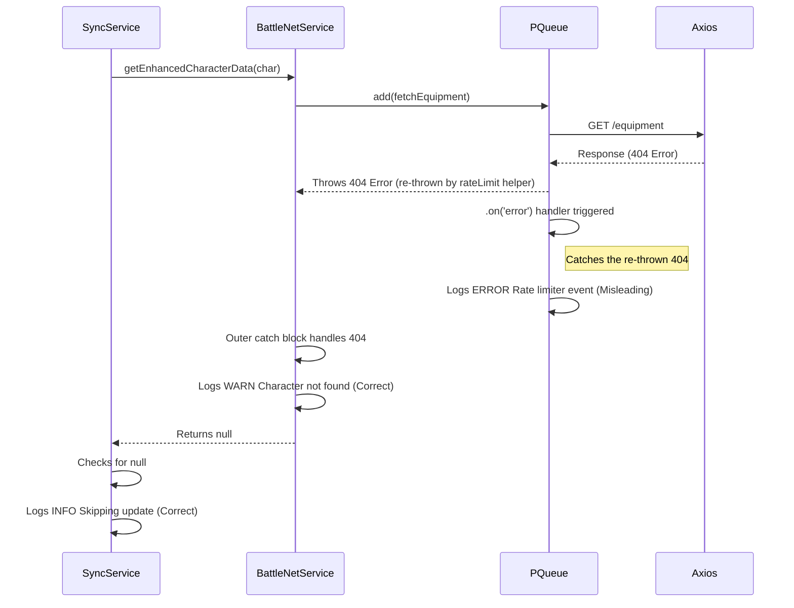

# Fix Misleading Battle.net 404 Error Logging

## Problem

During character synchronization, the backend logs show both a `WARN` and an `ERROR` message for the same underlying Battle.net API 404 (Not Found) error when fetching character data. This is redundant and the `ERROR` message is misleading as the 404 is actually handled gracefully.

**Example Logs:**

```log
[2025-03-29 20:12:57.477] WARN: [BattleNetService] Character casuntête on hyjal not found (404). Skipping enhanced data fetch.
    characterName: "casuntête"
    realm: "hyjal"
    region: "eu"
    status: 404
[2025-03-29 20:12:57.478] INFO: [ApiClient Limiter Done] Job char-eu-hyjal-casuntête finished.
    jobId: "char-eu-hyjal-casuntête"
    running: {}
[2025-03-29 20:12:57.479] INFO: [SyncService] Skipping update for character Casuntête (ID: 1842) due to fetch failure.
    charName: "Casuntête"
    charId: 1842
[2025-03-29 20:12:57.479] INFO: [SyncService] Character sync results: 50 fulfilled, 0 rejected.
    fulfilled: 50
    rejected: 0
[2025-03-29 20:12:57.479] INFO: [SyncService] Background sync run finished processing guilds and characters.
[2025-03-29 20:12:57.487] ERROR: [BattleNetService] Rate limiter error event.
    err: {
      "message": "Request failed with status code 404",
      "name": "AxiosError",
      "stack": ... (stack trace omitted) ...,
      "config": { ... (config omitted) ... },
      "code": "ERR_BAD_REQUEST",
      "status": 404
    }
```

## Analysis

The issue stems from the interaction between the `BattleNetService` (`battlenet.service.ts`), its internal `PQueue` rate limiter, and the `BattleNetSyncService` (`battlenet-sync.service.ts`).

1.  **`BattleNetService.getEnhancedCharacterData`:** This function fetches multiple character details (profile, equipment, etc.) using `Promise.all`. It has a specific `catch` block designed to handle 404 errors gracefully. When a 404 occurs (e.g., character doesn't exist), it logs the `WARN: [BattleNetService] Character ... not found (404). Skipping...` message and returns `null`.
2.  **`BattleNetService.rateLimit` Helper:** Each API call within `getEnhancedCharacterData` is wrapped by this helper. This helper uses `PQueue` for rate limiting. If an API call results in an error *other than* a 429 (Rate Limit Exceeded), the helper simply re-throws the original error.
3.  **`PQueue` Error Handler:** The `PQueue` instance in `BattleNetService` has a generic `.on('error', ...)` handler attached. This handler catches any error thrown by operations added to the queue that isn't caught *within* the operation's immediate wrapper (like the `rateLimit` helper's internal try/catch).
4.  **`BattleNetSyncService.syncCharacter`:** This service calls `getEnhancedCharacterData`. It correctly checks if the result is `null` (indicating a handled 404) and logs the `INFO: [SyncService] Skipping update...` message before moving to the next character.

**The Flow Leading to Redundant Logs:**



The core issue is that the `rateLimit` helper re-throws the 404 error, causing the generic `PQueue` error handler to log it as an unexpected `ERROR`, even though the `getEnhancedCharacterData` function handles it correctly moments later.

## Solution

Modify the generic `PQueue.on('error', ...)` handler in `backend/src/services/battlenet.service.ts` (around lines 66-69) to differentiate between handled 404s and genuinely unexpected errors.

**Current Code (line 68):**

```typescript
logger.error({ err: error }, '[BattleNetService] Rate limiter error event.');
```

**Proposed Code:**

```typescript
// Import axios if not already imported at the top
import axios from 'axios';
// ... inside constructor ...
this.rateLimiter.on('error', (error) => { // Added error parameter
  this.metrics.errorCount++;
  // Check if the error is an Axios error and specifically a 404
  if (axios.isAxiosError(error) && error.response?.status === 404) {
    // Log 404s caught by the queue handler at DEBUG level, as they are expected to be handled by the calling function.
    logger.debug({ err: error }, '[BattleNetService] Axios 404 caught by queue handler (handled by caller).');
  } else {
    // Log all other errors caught by the queue handler as ERROR, as they might be unexpected.
    logger.error({ err: error }, '[BattleNetService] Unhandled rate limiter/queue error event.');
  }
});
```

## Outcome

This change will prevent the misleading `ERROR` log for handled 404 errors. The logs will become clearer:
*   Handled 404s will only generate the specific `WARN` from `getEnhancedCharacterData` and the `INFO` from `SyncService`.
*   The `ERROR` log from the queue handler will be reserved for genuinely unexpected errors occurring within the rate limiting queue itself.