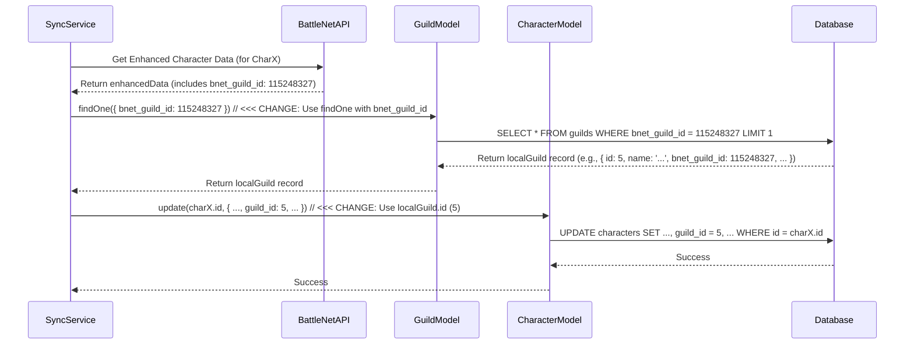

# Plan: Fix Character Sync Foreign Key Error

## 1. Problem Identification

Analysis of `logs/backend.log` revealed repeated errors during the character synchronization process within the `SyncService`.

**Key Log Messages:**

*   `[SyncService] Guild with ID 115248327 not found for character <character_name>`
*   `AppError: Error updating characters: insert or update on table "characters" violates foreign key constraint "characters_guild_id_fkey"`

These messages indicate that the sync process attempts to link characters in the `characters` table to a `guild_id` (specifically `115248327` in the logs) that does not exist as a primary key in the local `guilds` table, violating the foreign key constraint.

## 2. Root Cause Analysis

Code review of `backend/src/jobs/battlenet-sync.service.ts`, `backend/src/models/guild.model.ts`, and `backend/src/db/BaseModel.ts` identified the following issue in the `syncCharacter` method:

1.  **Incorrect Guild Lookup:** The code fetches the character's guild ID from the Battle.net API (`enhancedData.guild?.id`), which is the *Battle.net internal ID*. It then incorrectly attempts to look up the local guild record using `guildModel.findById(guild_id)` (line ~414 in `battlenet-sync.service.ts`). The `findById` method, as confirmed in `BaseModel.ts`, searches by the *local database primary key*, not the `bnet_guild_id`.
2.  **Incorrect Foreign Key Usage:** Because the lookup fails (the Battle.net ID doesn't match a local primary key), the subsequent update payload for the `characters` table incorrectly uses the *Battle.net ID* (`guild_id: guild_id`, line ~446) as the value for the `guild_id` foreign key column.
3.  **Database Constraint Violation:** The database rejects the update because the provided `guild_id` value (the Battle.net ID) does not reference a valid primary key in the `guilds` table, resulting in the `characters_guild_id_fkey` error.

## 3. Proposed Solution

Modify the `syncCharacter` method in `backend/src/jobs/battlenet-sync.service.ts` to correctly look up the local guild using the Battle.net ID and use the local primary key for the foreign key relationship.

**Specific Changes:**

1.  **Replace Guild Lookup:** Change the guild lookup logic (around line 414) from:
    ```typescript
    const guild = await guildModel.findById(guild_id);
    ```
    to use `findOne` with the `bnet_guild_id`:
    ```typescript
    const localGuild = await guildModel.findOne({ bnet_guild_id: guild_id });
    ```
2.  **Update Payload:** Modify the `updatePayload` (around line 446) to use the local guild's primary key (`id`):
    ```typescript
    guild_id: localGuild?.id, // Use the local DB primary key (or undefined if not found)
    ```
3.  **Adjust Region Logic:** Update references to `guild.region` (around lines 416, 420, 425) to use `localGuild?.region`.

## 4. Sequence Diagram



This approach ensures the correct local guild record is identified using the Battle.net ID, and its primary key is used to establish the foreign key relationship, resolving the constraint violation.