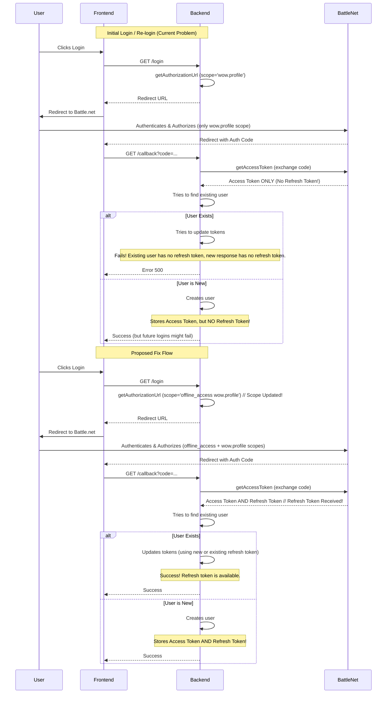

# Fix Missing Refresh Token Issue

## Problem Description

The application logs (`logs/backend.log`) show a recurring error during user login callbacks after successful authentication with Battle.net:

```log
[2025-03-29 13:41:34.456]  [31mERROR [39m:  [36mCannot update tokens: Missing new and existing refresh token. [39m
    userId: 1
[2025-03-29 13:41:34.456]  [31mERROR [39m:  [36mError handled by middleware: Failed to update tokens due to missing refresh token [39m
    error: {
      "name": "AppError",
      "message": "Failed to update tokens due to missing refresh token",
      "status": 500,
      "stack":
          AppError: Failed to update tokens due to missing refresh token
              at <anonymous> (/mnt/f/Projects/wow-guild-manager/backend/src/controllers/auth.controller.ts:142:20)
              at processTicksAndRejections (native:7:39)
    }
```

This indicates that when attempting to update tokens for an existing user (userId: 1), the application fails because it lacks both a new refresh token from the current Battle.net callback and an existing refresh token stored for the user. This issue started recently and affects all users attempting to log in again.

## Analysis

1.  **`auth.controller.ts` (Lines 130-150):**
    *   The code attempts to get a refresh token from the `tokenData` received from Battle.net.
    *   If `tokenData.refresh_token` is not a string, it falls back to `user.refresh_token` (the token stored in the database for the existing user).
    *   If *neither* of these is a valid string (i.e., both are missing or invalid), the error "Cannot update tokens: Missing new and existing refresh token." is thrown at line 142.

2.  **`battlenet.service.ts` - `getAccessToken` (Lines 444-479):**
    *   This function handles the OAuth 2.0 authorization code exchange with Battle.net.
    *   It correctly sends the `grant_type`, `code`, `redirect_uri`, and client credentials.
    *   It returns the `response.data` directly, which is expected to contain the `access_token`, `expires_in`, `scope`, and potentially the `refresh_token`.
    *   The function itself doesn't seem to be filtering out the refresh token.

3.  **`battlenet.service.ts` - `getAuthorizationUrl` (Lines 427-438):**
    *   This function generates the URL the user is redirected to for Battle.net authentication.
    *   Crucially, the `scope` parameter requested is only `'wow.profile'` (line 435).

## Root Cause

The primary reason for the missing refresh token is the absence of the `offline_access` scope in the initial authorization request sent to Battle.net. OAuth 2.0 providers like Battle.net typically require the `offline_access` scope to be explicitly requested to issue a refresh token alongside the access token. Without this scope, only an access token is usually returned.

## Proposed Fix

Modify the `getAuthorizationUrl` function in `backend/src/services/battlenet.service.ts` to include the `offline_access` scope.

**Change:**

Update line 435 from:
```typescript
`&scope=${encodeURIComponent('wow.profile')}`
```
to:
```typescript
`&scope=${encodeURIComponent('offline_access wow.profile')}`
```

## Flow Diagram (Current vs. Fixed)



## Testing Steps

1.  Apply the code change to `getAuthorizationUrl`.
2.  Test login with a completely new Battle.net account (if possible) or clear existing user data for a test account. Verify a refresh token is stored.
3.  Test login with an existing user account. Verify the "missing refresh token" error no longer occurs and tokens are updated.
4.  Log out and log back in with the existing user to ensure the refresh token persists and subsequent logins work.