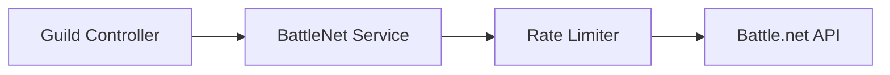
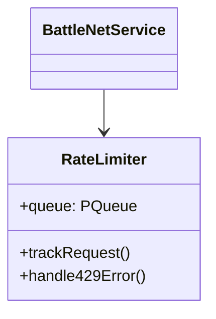

# Guild Member Enhancement Improvements

## Overview
Modifications to implement rank-based filtering and Battle.net API rate limiting for guild member enhancements.

### Affected Components


## Technical Specifications

### 1. Rank Filtering (guild.controller.ts)
**Modification Locations:**
- Line 239: Replace slice with rank filter
- Line 243: Implement batched processing

**Code Changes:**
```typescript
// Before (line 239)
const membersToEnhance = guildRoster.members.slice(0, 20);

// After
const allowedRanks = new Set([0, 1, 3, 4, 5]);
const membersToEnhance = guildRoster.members.filter(m => 
  allowedRanks.has(m.rank)
);
```

### 2. Rate Limiting System (battlenet.service.ts)
**Architecture:**


**Implementation Steps:**
1. Add dependency:
```bash
npm install p-queue@8.0.0
```

2. Create rate limiter class:
```typescript
import PQueue from 'p-queue';

const rateLimiter = new PQueue({
  interval: 1000,
  intervalCap: 98, // 2 req/sec buffer for safety
  carryoverConcurrencyCount: true
});
```

3. Modify API calls (example for getEnhancedCharacterData):
```typescript
async getEnhancedCharacterData(...) {
  return rateLimiter.add(() => this._getEnhancedCharacterData(...));
}

private async _getEnhancedCharacterData(...) {
  // Original implementation
}
```

### 3. Monitoring Metrics
**New Interface:**
```typescript
interface APIMetrics {
  lastRequest: Date;
  requestsLastMinute: number;
  errorCount: number;
  queueSize: number;
}

const metrics: APIMetrics = {
  // Initial values
};

// Update in rate limiter
rateLimiter.on('active', () => {
  metrics.queueSize = rateLimiter.pending;
});
```

## Risk Mitigation

| Risk | Mitigation Strategy |
|------|---------------------|
| API Rate Limit Breach | 90 req/sec initial limit with real-time monitoring |
| Queue Backpressure | Auto-scaling worker pool based on queue size |
| Data Consistency | Atomic update operations with transaction locks |

## Rollout Plan

1. **Phase 1 (Testing):**
   - Deploy to staging environment
   - Load test with 200 concurrent users

2. **Phase 2 (Monitoring):**
   - Enable metrics dashboard
   - Alert on >80% API capacity

3. **Phase 3 (Production):**
   - Gradual rollout to 10% of users
   - Full deployment after 24h stability

## Required Reviews
- [ ] Backend Team
- [ ] DevOps
- [ ] Security